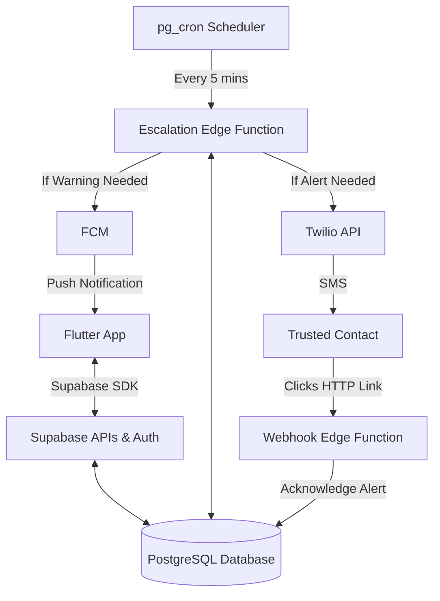

# 📱 Smart Check-In Safety App — MVP Implementation Plan (Supabase Edition)

## 🎯 Objective
Build a **reliable, low-friction safety check-in system** that:
- Minimizes user effort via **silent check-ins** (app activity)
- Reduces false alarms via a **confidence score**
- Escalates intelligently to **trusted contacts via SMS/Push**

> [!TIP]
> **MVP Focus:** Speed and reliability. By using Supabase, we eliminate backend boilerplate (FastAPI, Redis, Celery, Docker) and interact directly with the database via the Flutter SDK, moving scheduling and escalation logic into serverless Edge Functions.

---

# 🔷 1. MVP Scope (Strict)

## Core Features
- Manual check-in ("I'm OK")
- Scheduled check-ins (time window based)
- Silent check-ins (based on foreground app opens / active use)
- Confidence score (heuristic)
- Escalation to 1–2 contacts (via SMS through Twilio)
- Push notifications for user warnings (via FCM/Supabase)
- SMS Acknowledgment (Contacts can click a link to cancel the alert)
- Basic permissions onboarding

---

# 🔷 2. Tech Stack

## Frontend (Mobile)
- Flutter (iOS & Android)
- State Management: Riverpod
- Supabase Flutter SDK

## Backend (Serverless)
- **Supabase:**
  - Auth (replaces Firebase Auth)
  - PostgreSQL Database
  - PostgREST API (Auto-generated CRUD)
  - Edge Functions (TypeScript)
  - `pg_cron` & `pg_net` (Database native scheduler & HTTP worker)
- **Twilio**: SMS API (For notifying contacts who don't have the app)
- **Firebase Cloud Messaging (FCM)**: Push notifications to the User.

---

# 🔷 3. System Architecture



---

# 🔷 4. Detailed Implementation - AM-6: Supabase Setup

## SQL Schema & RLS Policies

```sql
-- 1. Profiles (Sync with Auth)
create table public.profiles (
  id uuid references auth.users on delete cascade primary key,
  name text,
  phone text,
  timezone text,
  push_token text,
  created_at timestamp with time zone default timezone('utc'::text, now()) not null
);

-- 2. Trigger for profile creation
create function public.handle_new_user()
returns trigger as $$
begin
  insert into public.profiles (id, name)
  values (new.id, new.raw_user_meta_data->>'name');
  return new;
end;
$$ language plpgsql security definer;

create trigger on_auth_user_created
  after insert on auth.users
  for each row execute procedure public.handle_new_user();

-- 3. Core Tables
create table public.contacts (
  id uuid default gen_random_uuid() primary key,
  user_id uuid references public.profiles(id) on delete cascade not null,
  name text not null,
  phone text not null,
  priority integer check (priority in (1, 2)) not null
);

create table public.checkin_schedules (
  id uuid default gen_random_uuid() primary key,
  user_id uuid references public.profiles(id) on delete cascade not null,
  start_time time not null,
  end_time time not null,
  timezone text not null,
  enabled boolean default true not null
);

create table public.checkin_events (
  id uuid default gen_random_uuid() primary key,
  user_id uuid references public.profiles(id) on delete cascade not null,
  scheduled_time timestamp with time zone not null,
  status text check (status in ('pending', 'completed', 'missed', 'escalating')) default 'pending' not null,
  confidence_score float default 0.0,
  created_at timestamp with time zone default now()
);

create table public.activity_signals (
  id uuid default gen_random_uuid() primary key,
  user_id uuid references public.profiles(id) on delete cascade not null,
  type text check (type in ('app_open', 'manual_checkin')) not null,
  created_at timestamp with time zone default now()
);

create table public.alerts (
  id uuid default gen_random_uuid() primary key,
  user_id uuid references public.profiles(id) on delete cascade not null,
  checkin_event_id uuid references public.checkin_events(id) on delete cascade not null,
  contact_id uuid references public.contacts(id) on delete cascade not null,
  status text check (status in ('sent', 'acknowledged')) default 'sent' not null,
  acknowledgement_token uuid default gen_random_uuid() not null,
  created_at timestamp with time zone default now()
);

-- 4. Enable RLS
alter table public.profiles enable row level security;
alter table public.contacts enable row level security;
alter table public.checkin_schedules enable row level security;
alter table public.checkin_events enable row level security;
alter table public.activity_signals enable row level security;
alter table public.alerts enable row level security;

-- 5. RLS Policies
create policy "Users can view own profile" on public.profiles for select using (auth.uid() = id);
create policy "Users can update own profile" on public.profiles for update using (auth.uid() = id);

create policy "Users can manage own contacts" on public.contacts for all using (auth.uid() = user_id);
create policy "Users can manage own schedules" on public.checkin_schedules for all using (auth.uid() = user_id);
create policy "Users can view own events" on public.checkin_events for select using (auth.uid() = user_id);
create policy "Users can insert own signals" on public.activity_signals for insert with check (auth.uid() = user_id);
create policy "Users can view own alerts" on public.alerts for select using (auth.uid() = user_id);
```

---

# 🔷 5. Unified Build Plan (3-4 Weeks)

## Week 1: Foundation & Supabase Setup
- Initialize Flutter project with Riverpod & routing.
- **[AM-6]** Set up Supabase project, create tables, and write Row Level Security (RLS) policies.
- **[AM-7]** Implement Supabase Auth (Sign up / Login) in Flutter.

## Week 2: Core UX & SDK Integration
- Build Onboarding UI and Permissions request flow.
- Build Contacts management UI & database integration.
- Build Dashboard UI and "Manual Check-in" logic.
- Implement AppLifecycle tracking to record "App Open" events to Supabase.

## Week 3: Background Logic (Edge Functions)
- Write the `pg_cron` database job to schedule tick events.
- Write the `escalation-worker` Typescript Edge function.
- Integrate Twilio API into Edge Function.
- Write the `alert-webhook` Edge Function to generate the public HTML acknowledgment page.

## Week 4: Polish & Testing
- Integrate Firebase Cloud Messaging via Supabase Edge integrations.
- Exhaustive timezone testing.

---

# 🔷 6. Detailed Implementation - AM-7: Supabase Auth

## Objective
Implement core authentication using the Supabase Flutter SDK and Riverpod for state management.

## Proposed Changes

### [Component] Lib (`/lib`)

#### [MODIFY] [main.dart](file:///home/mofassir/PycharmProjects/angelMVP/angle_mvp/lib/main.dart)
Initialize the Supabase SDK with the local URL and anon key.

### [Component] Features (`/lib/features`)

#### [NEW] `auth/providers/auth_provider.dart`
Create a Riverpod provider to manage the user session and auth state.
```dart
final supabaseAuthProvider = StreamProvider((ref) => Supabase.instance.client.auth.onAuthStateChange);
```

#### [NEW] `auth/screens/login_screen.dart`
A modern, premium login screen with:
- Email/Password input validation.
- Loading states for the "Login" button.
- Error feedback using Snackerbars.

#### [NEW] `auth/screens/signup_screen.dart`
Registration screen with:
- Name, Email, Password inputs.
- Passwords confirmation logic.

### [Component] Core (`/lib/core`)

#### [MODIFY] `router/router_provider.dart` (or `main.dart`)
Implement an `AuthGuard` using GoRouter to:
- Redirect unauthenticated users to `/login`.
- Redirect authenticated users from `/login` to `/dashboard`.

## Open Questions

- **Local Development Credentials**: Since you're running Supabase in Docker, the URL should typically be `http://localhost:8000`. I will retrieve the `ANON_KEY` from the `.env` file in the `angel_mvp_subabase` directory.
- **Styling Preference**: Should I use a specific design language (e.g., Material 3 with custom colors) for the Auth screens? (I'll aim for a "premium, trust-focused" look by default).

## Verification Plan

### Automated Tests
- Integration test for `Supabase.instance.client.auth.signInWithPassword`.
- Unit test for the `AuthProvider` state transitions.

### Manual Verification
- Visual check of Login/Signup screens.
- Test successful signup check if `profiles` row is created.
- Test login with valid/invalid credentials.

---

# 🧠 Core Principle

This is not an AI product. This is a **trust product**.

- Reliability > Intelligence  
- Simplicity > Features  
- Consistency > Cleverness
 product. This is a **trust product**.

- Reliability > Intelligence  
- Simplicity > Features  
- Consistency > Cleverness