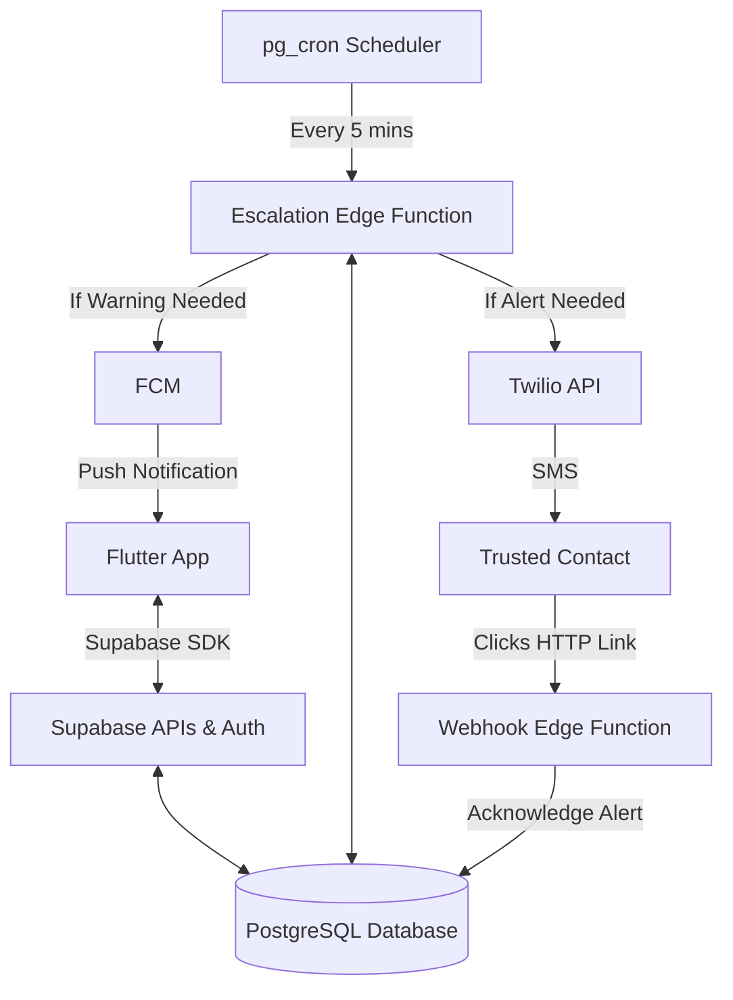

# 📱 Smart Check-In Safety App — MVP Implementation Plan (Supabase Edition)

## 🎯 Objective
Build a **reliable, low-friction safety check-in system** that:
- Minimizes user effort via **silent check-ins** (app activity)
- Reduces false alarms via a **confidence score**
- Escalates intelligently to **trusted contacts via SMS/Push**

> [!TIP]
> **MVP Focus:** Speed and reliability. By using Supabase, we eliminate backend boilerplate (FastAPI, Redis, Celery, Docker) and interact directly with the database via the Flutter SDK, moving scheduling and escalation logic into serverless Edge Functions.

---

# 🔷 1. MVP Scope (Strict)

## Core Features
- Manual check-in ("I'm OK")
- Scheduled check-ins (time window based)
- Silent check-ins (based on foreground app opens / active use)
- Confidence score (heuristic)
- Escalation to 1–2 contacts (via SMS through Twilio)
- Push notifications for user warnings (via FCM/Supabase)
- SMS Acknowledgment (Contacts can click a link to cancel the alert)
- Basic permissions onboarding

> [!WARNING]
> **OS Throttling Constraint:** For the MVP, we will rely on "App Open" and "Manual Check-ins" to build confidence scores. iOS and Android severely throttle background "heartbeats" and "movement tracking", which would cause false positive alerts.

---

# 🔷 2. Tech Stack

## Frontend (Mobile)
- Flutter (iOS & Android)
- State Management: Riverpod
- Supabase Flutter SDK

## Backend (Serverless)
- **Supabase:**
  - Auth (replaces Firebase Auth)
  - PostgreSQL Database
  - PostgREST API (Auto-generated CRUD)
  - Edge Functions (TypeScript)
  - `pg_cron` (Database native scheduler)
- **Twilio**: SMS API (For notifying contacts who don't have the app)
- **Firebase Cloud Messaging (FCM)**: Push notifications to the User.

---

# 🔷 3. System Architecture



---

# 🔷 4. Data Models

*Note: Supabase handles core authentication in the `auth.users` schema. We will create a public schema extension mapping to those IDs.*

## profiles (Public User Data)
```sql
profiles {
  id (uuid, references auth.users)
  name
  phone
  timezone
  push_token (string)
  created_at
}
```

## contacts
```sql
contacts {
  id (uuid)
  user_id (uuid)
  name
  phone (e.164 format for Twilio)
  priority (1 or 2)
}
```

## checkin_schedules
```sql
checkin_schedules {
  id (uuid)
  user_id (uuid)
  start_time (time)
  end_time (time)
  timezone (string) -- e.g. "America/New_York"
  enabled (bool)
}
```

## checkin_events
```sql
checkin_events {
  id (uuid)
  user_id (uuid)
  scheduled_time (datetimez)
  status (pending, completed, missed, escalating)
  confidence_score (float)
  created_at
}
```

## activity_signals
```sql
activity_signals {
  id (uuid)
  user_id (uuid)
  type (app_open, manual_checkin)
  created_at (datetimez)
}
```

## alerts
```sql
alerts {
  id (uuid)
  user_id (uuid)
  checkin_event_id (uuid)
  contact_id (uuid)
  status (sent, acknowledged)
  acknowledgement_token (uuid, for webhooks)
  created_at
}
```

---

# 🔷 5. Edge Functions & API Design

Since CRUD is handled by the Supabase Flutter SDK (with Row Level Security), we only need custom Edge Functions for background logic.

### 1. `escalation-worker` (Triggered via `pg_cron`)
A Typescript function running every 5 minutes:
1. Queries users in `active` check-in windows.
2. Calculates Confidence Score based on `activity_signals`.
3. If missed & score is low, transitions to `escalating`.
4. Sends Warning Push Notification (FCM).
5. If still unacknowledged after grace period, triggers Twilio SMS to `contacts`.

### 2. `alert-webhook` (Public HTTP GET)
When a contact receives an SMS: *"Alert: [User] missed their check-in. Tap to acknowledge you are handling this: https://[supabase-url]/functions/v1/alert-webhook?token=XYZ"*
1. Validates the `token`.
2. Updates `alerts` status to `acknowledged`.
3. Displays a simple HTML success page (e.g., "Alert acknowledged, the escalation chain has stopped.").

---

# 🔷 6. Flutter App Architecture

## Folder Structure

```
lib/
 ├── core/
 │   ├── providers/ (Supabase, Auth state)
 │   ├── theme/
 │
 ├── features/
 │   ├── onboarding/ (Includes Permission requests)
 │   ├── dashboard/ (Status, "I'm OK" button)
 │   ├── settings/ (Manage Schedules & Contacts)
 │   
 ├── shared/
 │   ├── models/ (Freezed/JsonSerializable data classes)
 │   ├── widgets/
 │
 └── main.dart
```

---

# 🔷 7. Critical Flows

## The "Silent Check-In"
1. User opens the app.
2. Flutter AppLifecycleHandler detects `resumed`.
3. Mobile app inserts a row into `activity_signals` (type: `app_open`).
4. Next time `pg_cron` runs, the `escalation-worker` sees the recent `app_open` signal, gives the user a passing confidence score, and marks the impending check-in as `completed` without the user ever pressing a button.

## Onboarding Permissions Flow
To prevent failure rates, onboarding MUST explicitly request:
1. **Push Notifications:** Mandatory to receive pre-escalation warnings.
2. **Current Timezone:** Derived from device and sent to Supabase to calculate windows perfectly.

---

# 🔷 8. Unified Build Plan (3-4 Weeks)

## Week 1: Foundation & Supabase Setup
- Initialize Flutter project with Riverpod & routing.
- Set up Supabase project, create tables, and write Row Level Security (RLS) policies.
- Implement Supabase Auth (Sign up / Login) in Flutter.

## Week 2: Core UX & SDK Integration
- Build Onboarding UI and Permissions request flow.
- Build Contacts management UI & database integration.
- Build Dashboard UI and "Manual Check-in" logic.
- Implement AppLifecycle tracking to record "App Open" events to Supabase.

## Week 3: Background Logic (Edge Functions)
- Write the `pg_cron` database job to schedule tick events.
- Write the `escalation-worker` Typescript Edge function.
- Integrate Twilio API into Edge Function.
- Write the `alert-webhook` Edge Function to generate the public HTML acknowledgment page.

## Week 4: Polish & Testing
- Integrate Firebase Cloud Messaging via Supabase Edge integrations.
- Exhaustive timezone testing (ensuring local device times align with UTC backend crons).
- Edge-case testing (failed SMS, missing permissions).

---

# 🧠 Core Principle

This is not an AI product. This is a **trust product**.

- Reliability > Intelligence  
- Simplicity > Features  
- Consistency > Cleverness